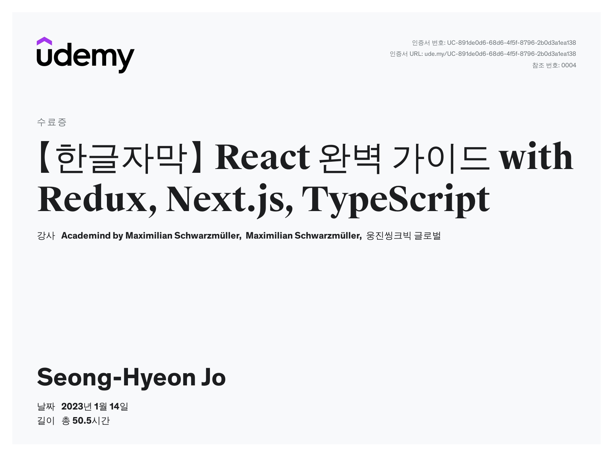
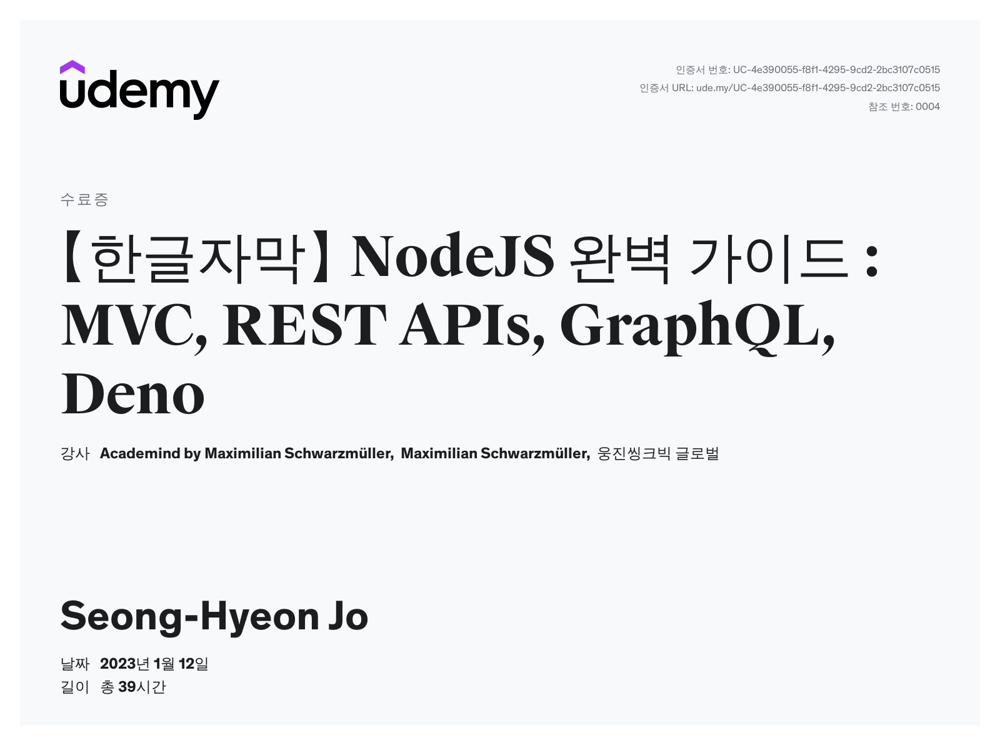

# 자료 설명
### 해당 자료는 지금까지 배운 MERN 스택의 핵심인 React와 NodeJS의 기술을 복습하는 자료입니다.
### 파일 마다 제공하는 내용은 아래와 같으니 참고해주시길 바랍니다.
 
 

# React_File
## React(v18) 커리큘럼
### - React 기초 문법 및 심화 문법

### - UI 컴포넌트 설계 및 구축 방법

### - React Router를 사용한 라우팅 설계

### - 이벤트 처리

### - React 작동원리

### - React hooks 딥다이브(useCallback, useMemo, useReducer)

### - 나만의 custom hooks 만들기

### - Styled Components, CSS를 활용한 UI Styling

### - Fragments & Portals 다루는 법

### - Context API 와 Redux Toolkit를 사용한 상태관리

### - side effect 처리하는 법

### - http 요청, 응답 처리법

### - React with Next.js

### - React with TypeScript

### - 토큰을 활용한 회원가입, 로그인 구현

### - 단위 테스트 기반의 개발 방법

### - React 애플리케이션을 배포하는 법
 

## React 과정 수료증

 
 

# NodeJS_File
## NodeJS(v16) 커리큘럼

### - Node.js의 기본 개념과 코어 모듈

### - 요청 분석 및 응답 전송

### - 서버에서의 동적 HTML 렌더링

### - Express.js 활용

### - 서버에서 파일 작업 및 PDF 즉시 생성

### - 파일 업로드 및 다운로드

### - 모델-뷰-컨트롤러 (MVC) 패턴 사용하기

### - Node.js에 SQL (MySQL) 및 Sequelize 사용하기

### - Node.js에 NoSQL (MongoDB) 및 Mongoose 사용하기

### - 세션 및 쿠키 작업

### - 사용자 인증 및 권한 부여

### - 이메일 전송

### - 사용자 입력값 유효성 검사

### - 데이터 페이지화(Pagination)

### - Stripe.js로 결제 다루기

### - REST API 구축

### - REST API 내 인증 구현

### - REST API 내 파일 업로드

### - GraphQL API 구축

### - GraphQL API 내 인증 구현

### - GraphQL API 내 파일 업로드

### - Websocket을 통해 실시간 Node.js 앱 구축하기

### - 테스트 자동화 (유닛 테스트)

### - Node.js 애플리케이션 배포

### - Node.js with TypeScript

### - Deno.js 탐구하기
 

## NodeJS 과정 수료증

 
 